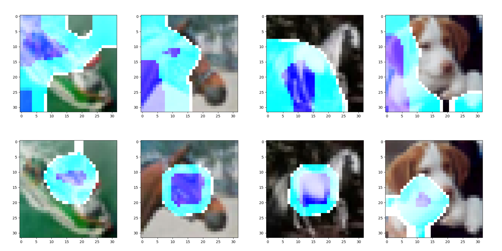

# Multi-dilated_CAM

A personal implement of CAM(class activation mapping) part of *CVPR 2018 Revisiting Dilated Convolution: A Simple Approach for Weakly- and Semi- Supervised Sematic Segmentation*.

VGG16+GAP+CAM on CIFAR10. 

*Not finished yet...*

## Requirment

- python 3.6.8
- pytorch 1.0.1
- cudnn 7.6.0
- numpy 1.16.4

## Run

```
python main.py
```

If you want to use the version of the GPU, please modify the code at the comment 'GPU'.

## Results

The first line is the results of training 1/200 epoch, and the second line is the results of training 21/200 epoch. 

